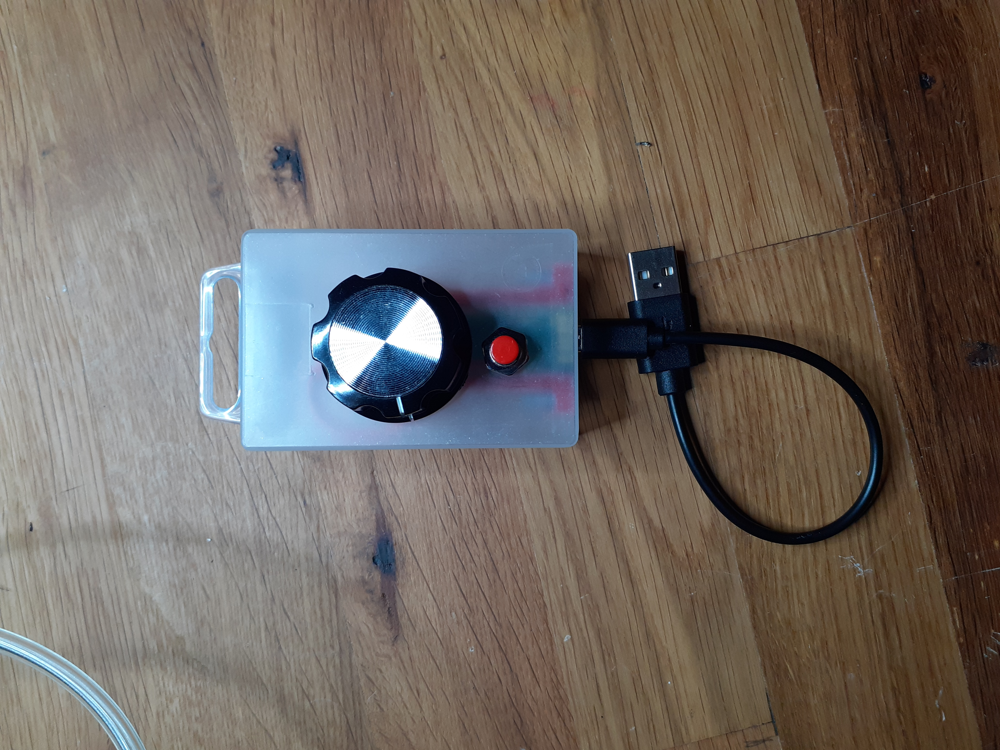
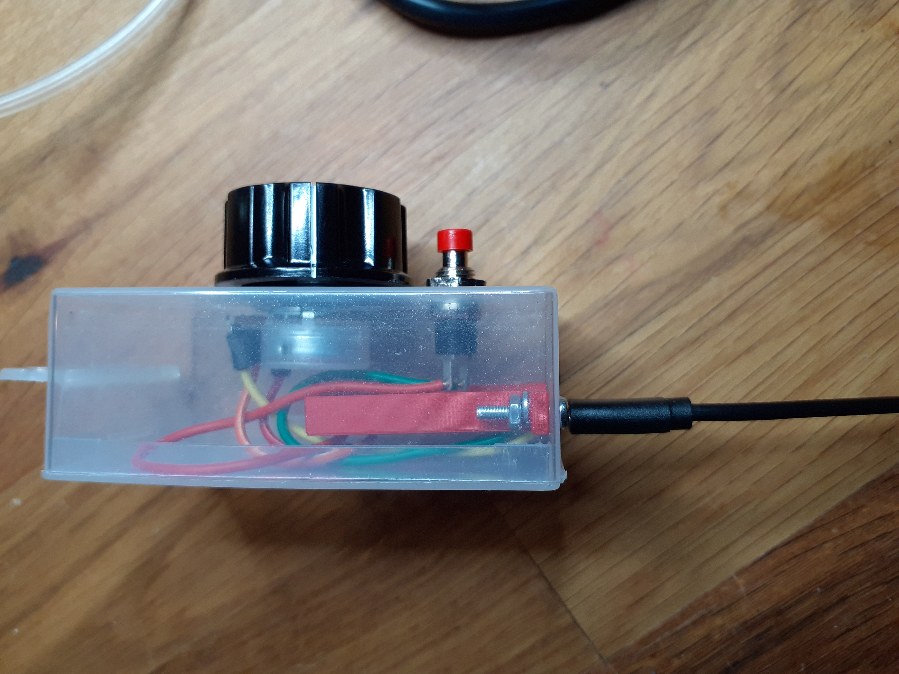

## Compiling
The project is setup as platformio project.

From the root of this repo run:
```bash
pio run -t upload
```

This will compile and upload the code to your Teensy

## Connections

Button:
Connect pin 1 of button to 3.3v
Connect pin 2 of button to pin 1

Pot:
Connect pin1 to 3.3v
Connect pin2 to A0 (pin 14)
Connect pin3 to GND

## Using as Server volume controller in SuperCollider

Setting this up to use as master volume controller in SuperCollider is pretty easy. 
Copy/paste the code in the supercollider example file into your SuperCollider startup file to automatically set this up.


